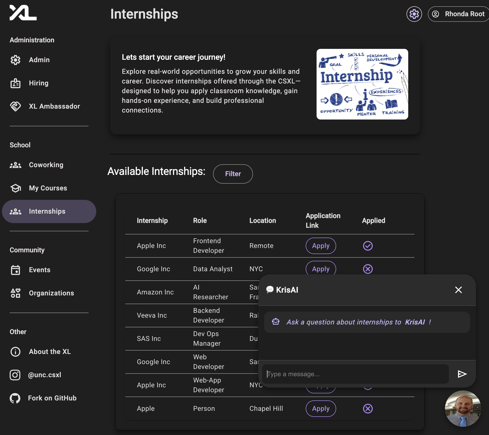
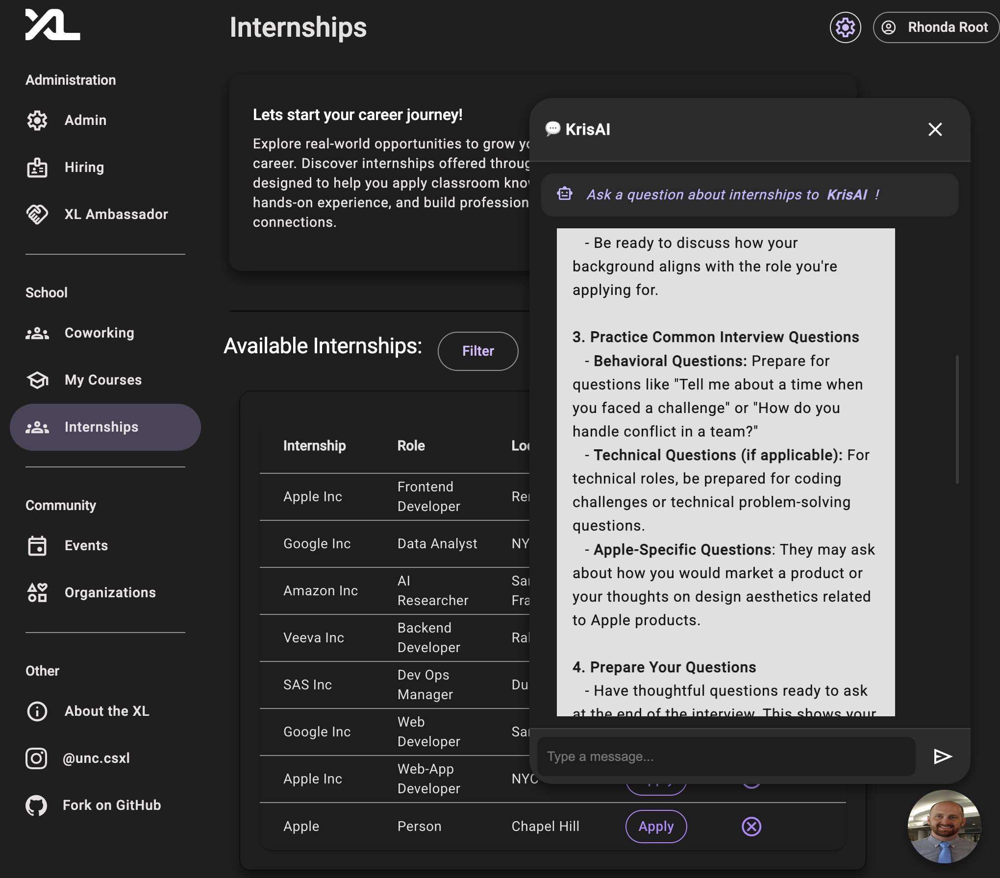
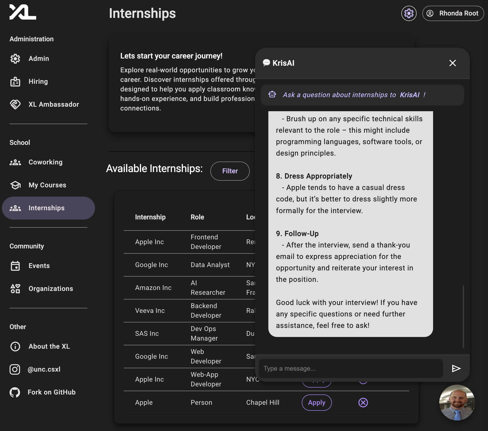
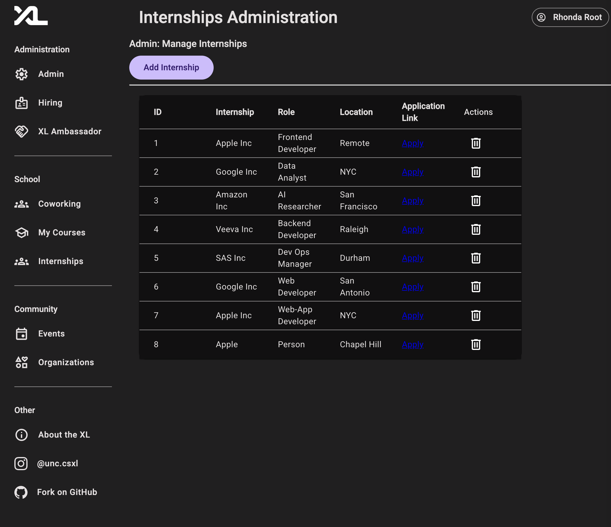
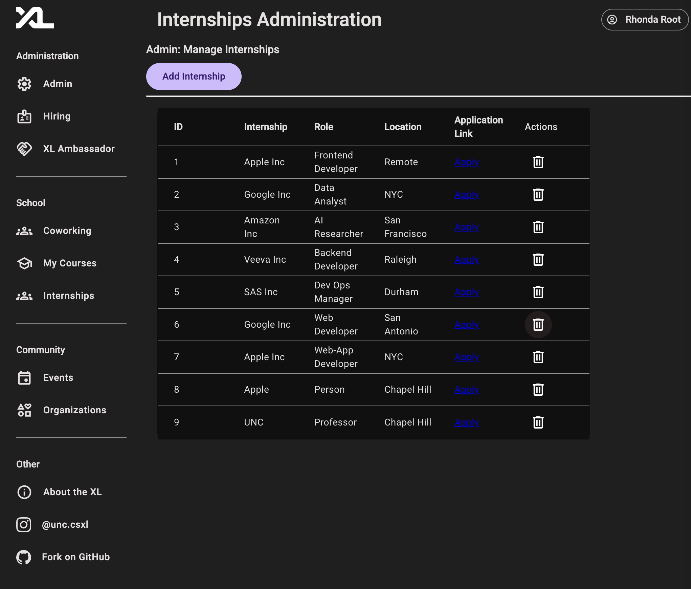
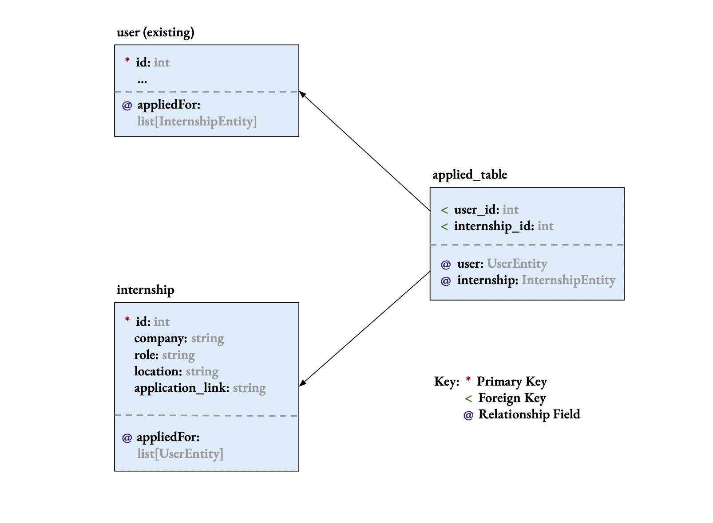
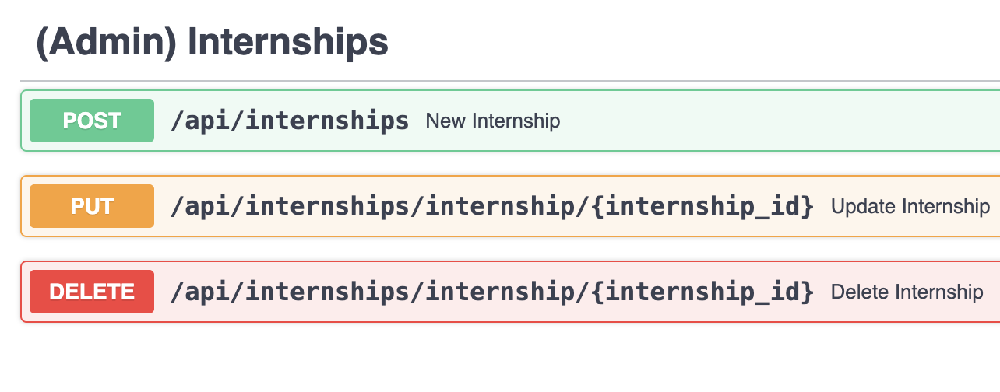

# Internships and ChatBot Implementation Documentation

> Written by [Carmine from Team A1](https://github.com/comp423-25s/csxl-team-a1) for the CSXL Web Application.<br> _Last Updated: 05/02/2025_

This document contains technical specifications for the Internships feature of the CSXL web application. This feature adds _2_ new database tables, _4_ new API routes, and _4_ new frontend components to the application.

The Internships Feature adds a table of internships by scraping internship data from a world-reknown github repository to the CSXL web application. The CSXL web application can now store this internship data, which includes roles, company names, application links and locations to each internship.

## Authors/Contributors

- [Elijah Wood](https://github.com/ElijahWood2003)
- [Arden Feldt](https://github.com/Arden-Feldt)
- [Siddhant Saxena](https://github.com/sisaxena42)
- [Carmine Anderson - Falconi](https://github.com/carmine-anderson)

## Table of Contents

- [Frontend Features](#frontend-features)
  - [User Features](#user-features)
    - [Internships Home](#internships-home)
    - [Filtering Component](#filtering-component)
      - [Filtering by company name](#filtering-by-company-name)
    - [KrisAI](#krisai-chatbot-component)
    - [Admin-View Component](#admin-view-component)
- [Conclusions](#conclusions)
- [Backend Design and Implementation](#backend-design-and-implementation)
  - [Entity Design](#entity-design)
  - [Pydantic Model Implementation](#pydantic-model-implementation)
  - [API Implementation](#api-implementation)
  - [Permission Summary](#permission-summary)
- [Testing](#testing)
- [Future Considerations](#future-considerations)

## Frontend Features<a name='FrontendFeatures'></a>

The frontend features add _4_ new Angular components, all at the `/internships` route.

### User Features<a name='UserFeatures'></a>

The following pages have been added and are available for all users on the CSXL site. These pages are ultimately powered by new Angular service functions connected to new backend APIs.

### Internships Home<a name='InternshipsHome'></a>


The home page for the new Internships feature is available on the side navigation toolbar at `/internships`. The home page contains a filtering bar, KrisAI, and a table of internships which are scraped from a github repository of internships available, updated weekly.

### Filtering Component<a name='FilteringComponent'></a>


The filtering bar allows users to filter through the internships available. You can filter the internships using the company name, role, and or location. An example of using the company name can be seen below.

### Filtering by company name<a name='FilterEx'></a>


As you can see, if I was searching for jobs offered by `Apple Inc`, you can apply the filter, and the data for the current open positions that are available will be shown to the user.

### KrisAI Chatbot Component<a name='KrisAIComponent'></a>

As seen in the bottom right corner of the first photo, we have KrisAI, a CSXL chatbot ready to help the users with any internship question or prep. Upon clicking KrisAi, you are greeted with the prompt `Ask a question about internships to KrisAi!`



You can ask KrisAI to help you prepare for interviews or to even provide you practice questions.
For this example, I asked it `Hey KrisAI! Can you help me prepare for an interview with Apple?` to which it gave an open ended, and very helpful response.





As seen above, KrisAi was extremely helpful with providing help to the user with an interview coming up.

### Admin-View Component<a name='AdminComponent'></a>

As seen in the following image, the internships home page has a settings bar in the top right corner near the logged in user button, this is a tool that can be used by authorized users to add a new internship to the database so that the end users (students) will be able to apply to.




From here, anyone with the permissions to do so, have access to creating a new internship for the database. An example of adding a UNC Professor Application




Admins are also allowed to delete the internships from the database as shown below, by clicking the trash can button.


### Conclusions<a name='Conclusions'></a>

In total, the following components have been added:

| Name                     | Route                                 | Description                                                         |
| ------------------------ | ------------------------------------- | ------------------------------------------------------------------- |
| **Internship Home**      | `/internships`                        | Main home page for the internships feature.                         |
| **Filtering Component**  | `/internships/widgets/filter`         | Filters through the internships table.                              |
| **KrisAI Component**     | `/internships/widget.Chat-bot-widget` | KrisAi chatbot to help with internship prep.                        |
| **Admin-View Component** | `/internships/internships-admin`      | The Admin view allows the creation and deletion of new internships. |

## Backend Design and Implementation<a name='BackendDesignandImplementation'></a>

The internships feature ultimately adds _2_ new database tables and _4_ new API routes.

### Entity Design<a name='EntityDesign'></a>

The Internships Feature adds two new database tables and entities. They are as follows:

| Table Name       | Entity             | Description                                                             |
| ---------------- | ------------------ | ----------------------------------------------------------------------- |
| `internship`     | `InternshipEntity` | Stores internship information for each internship.                      |
| `applied__table` | `Join Table`       | Persists a many to many relationship between user and internship table. |

The fields and relationships between these entities are shown below:



As you can see, the two association tables defined by `InternshipEntity` and `Join Table` relate to (and therefore add relationship fields to) the existing `user` table.

### Pydantic Model Implementation<a name='PydanticModelImplementation'></a>

The Pydantic models for internship and filterQuery are nearly one-to-one with their entity counterparts. However, sections utilize a more custom model structure, as shown below:

<table>
<tr><th width="520">`Internship` and `filterQuery` Models</th></tr>
<tr>
<td>

```py
class Internship(BaseModel):
    """
    Model to represent an `Internship`.
    """

    id: Optional[int] = None
    company: str
    role: str
    location: str
    applicationLink: str
    datePosted: Optional[date] = None
    deadline: Optional[date] = None
    appliedFor: bool = False


class filterQuery(BaseModel):
    """
    Model to represent query filters for the internship table
    """


    company: Optional[str] = None
    role: Optional[str] = None
    location: Optional[str] = None
    appliedFor: Optional[bool] = None

    @classmethod
    def as_query(cls):
        """Helper method to create query parameters from the model"""
        return Query(None, description="Filter criteria for internships")

```

</td>
</tr>
</table>

As you can see, the 'Internship' model closely follows the equivalent Internship interface (in TypeScript) and InternshipEntity in the database entities. This helps to simplify the logic and maintain logic across the stack.

We also have a filterQuery model which we use to easily build filter queries in our frontend to query our database. We convert this model into parameters for the GET API request.

### API Implementation<a name='APIImplementation'></a>

The Internships and chatbot feature adds 5 new API routes to handle the operations needed to move the needed data.

Here is a summary of the APIs added:

#### Internship and Chatbot APIs:


#### Admin-View Internship APIs:



### Permission Summary<a name='PermissionSummary'></a>

All of these API routes call on **backend service functions** to perform these operations. Some of these backend services are protected by permissions, those being the ones utilized by the Admin-View. This is because, the end users need to access the chatbot and get API calls to use. Here is a summary of the permissions that this feature added:

| Action                 | Resource                                   | Description                                                          |
| ---------------------- | ------------------------------------------ | -------------------------------------------------------------------- |
| `"internships.create"` | `"internships"`                            | Gives the user permission to create new internships in the database. |
| `"internships.update"` | `"internships/internship/{internship_id}"` | Gives the user permission to update a internship in the database.    |
| `"internships.delete"` | `"internships/internship/{internship_id}"` | Gives the user permission to delete a internship in the database.    |

### Testing<a name='Testing'></a>

The Internship feature adds full, thorough testing to every new service function added in the internship services. All tests pass, and all services created or modified have ~100% test coverage.

## Future Considerations<a name='FutureConsiderations'></a>

- We would like to integrate KrisAI with our database so that users can directly ask questions about the internships that are available on the page.
- We would like to also automatically check and update the internships weekly according to the github page that updates weekly. In shorter terms, make it update accordingly. [Link to Github Repository](https://github.com/cvrve/Summer2025-Internships#we-love-our-contributors-%EF%B8%8F%EF%B8%8F)